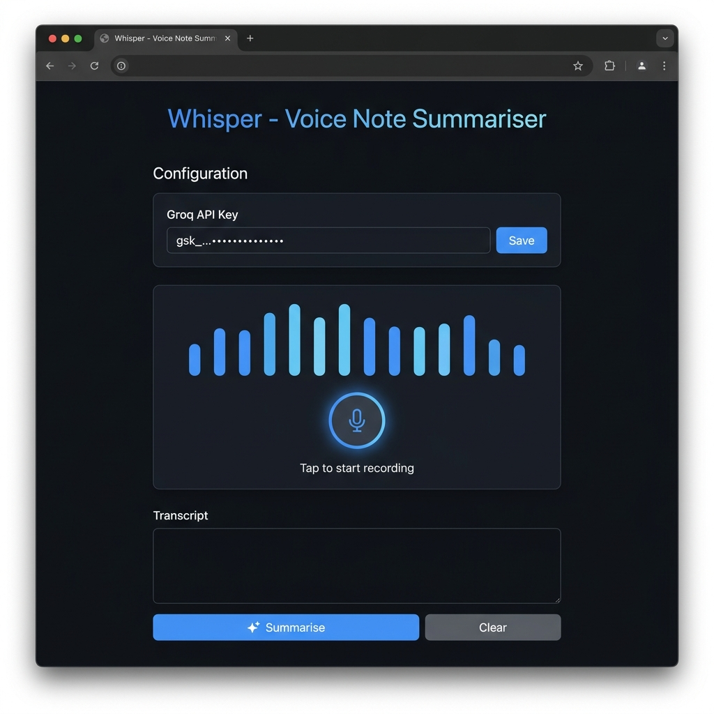
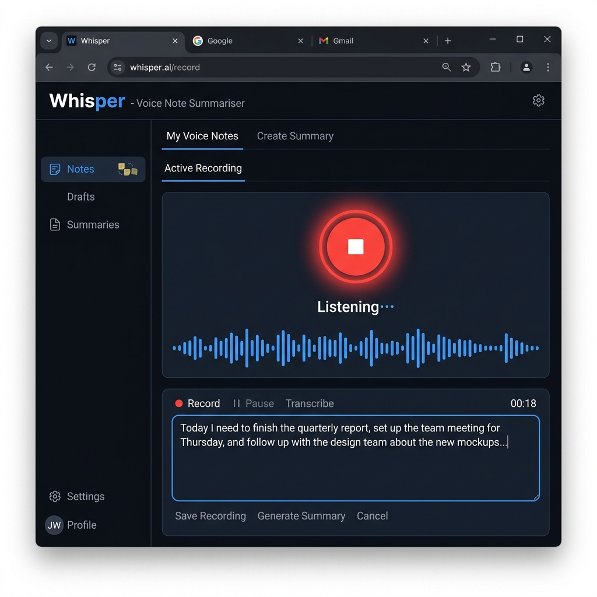
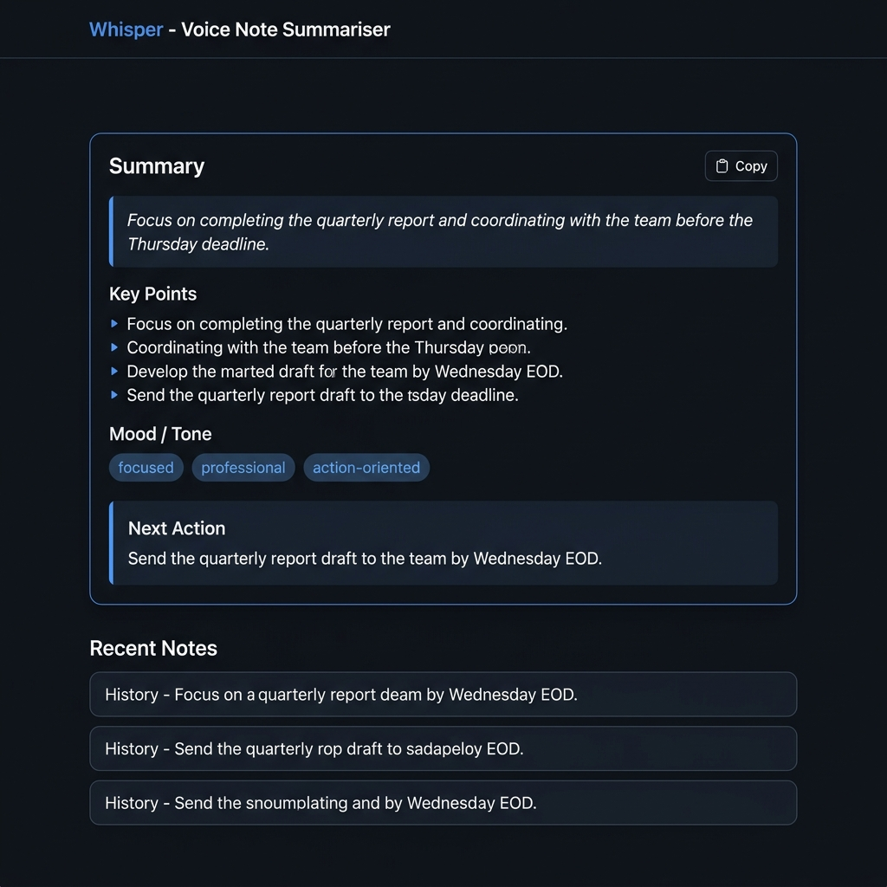

<div align="center">

# 🎙️ Whisper

### Voice notes, distilled into clarity

[](LICENSE)
[](#)
[](https://groq.com)
[](#-quick-start)
[](#)

A beautifully minimal, single-file voice note app that records your speech, transcribes it in the browser, and uses **Groq AI (Llama 3.3 70B)** to distil it into a structured summary — completely free.

[**▶ Try it now**](#-quick-start) · [**See it in action**](#-screenshots) · [**Deploy it**](#-deploy)

</div>

---

## 📸 Screenshots

<table>
  <tr>
    <td align="center"><b>🏠 Main Interface</b></td>
    <td align="center"><b>🎤 Recording</b></td>
    <td align="center"><b>✦ AI Summary</b></td>
  </tr>
  <tr>
    <td></td>
    <td></td>
    <td></td>
  </tr>
  <tr>
    <td align="center"><sub>Clean dark interface with API key setup</sub></td>
    <td align="center"><sub>Live waveform + real-time transcription</sub></td>
    <td align="center"><sub>Structured AI summary with mood tags</sub></td>
  </tr>
</table>

---

## ✨ Features

| Feature | Details |
|---|---|
| 🎤 **Voice Recording** | Browser's built-in Web Speech API — no external STT service |
| 〰️ **Live Waveform** | Animated bars visualise audio while recording |
| 🤖 **AI Summarisation** | Groq `llama-3.3-70b-versatile` — blazing fast, free tier |
| 📋 **Structured Output** | Gist · Key Points · Mood Tags · Next Action |
| 📋 **One-click Copy** | Copy the full summary to clipboard instantly |
| 💾 **History** | Last 5 notes auto-saved to `localStorage` |
| 🔑 **Privacy-first** | API key stays in your browser, never on a server |
| 🎨 **Premium UI** | Dark mode, Lora + Inter fonts, smooth animations |

---

## 🚀 Quick Start

> **No installation. No npm. No build step.**

**1. Get a free API key**

Go to [console.groq.com/keys](https://console.groq.com/keys) → sign up → create a key (starts with `gsk_`)

**2. Open the app**

Just double-click `index.html` in Chrome or Edge.

**3. Paste & go**

Paste your key → hit **Save** → tap the mic → speak → click **✦ Summarise**

---

## 💰 Why it's free

<details>
<summary><b>Click to see provider comparison</b></summary>

| Provider | Free Tier | Speed | Notes |
|---|---|---|---|
| **Groq ✅** | ~14,400 req/day | ⚡ Ultra-fast | No credit card required |
| Google Gemini | Limited / regional | Moderate | Quota varies by region |
| Anthropic Claude | ❌ Paid only | Moderate | Pay-per-token |
| OpenAI GPT | ❌ Paid only | Moderate | Pay-per-token |

Whisper uses **Groq** — the fastest free LLM inference available today.

</details>

---

## 📦 Deploy

<details>
<summary><b>Netlify (Recommended — 1 minute)</b></summary>

1. Go to [app.netlify.com/drop](https://app.netlify.com/drop)
2. Drag the entire `whisper/` folder onto the page
3. Done — your app is live at a public URL

</details>

<details>
<summary><b>GitHub Pages</b></summary>

1. Push this repo to GitHub
2. Go to **Settings → Pages**
3. Set source to **Deploy from branch → main → / (root)**
4. Visit `https://yourusername.github.io/whisper`

</details>

<details>
<summary><b>Local (instant)</b></summary>

```bash
git clone https://github.com/sharma614/whisper
# then just double-click index.html
```

</details>

---

## 🌐 Browser Support

| Browser | 🎤 Recording | 🤖 Summarisation |
|---|---|---|
| Chrome / Edge | ✅ Full support | ✅ |
| Firefox | ❌ No Web Speech API | ✅ (type transcript manually) |
| Safari | ⚠️ Partial | ✅ |

> 💡 **Tip:** Even without mic support, you can paste or type any text into the transcript box and still get an AI summary.

---

## 🔒 Privacy

- 🎙️ Voice is processed by the **browser's built-in speech engine** — never sent to any server
- 📝 Only the **text transcript** reaches Groq's API — no audio leaves your device
- 🔑 Your API key lives **only in `localStorage`** — not in any database or backend

---

## 🗂️ File Structure

```
whisper/
├── index.html        ← entire app (HTML + CSS + JS, ~760 lines)
├── README.md
└── docs/
    ├── screenshot-main.png
    ├── screenshot-recording.png
    └── screenshot-summary.png
```

---

## 📄 License

MIT — free to use, modify, and deploy.

---

<div align="center">
  Made with ♥ · Powered by <a href="https://groq.com">Groq</a> + Llama 3.3
</div>
